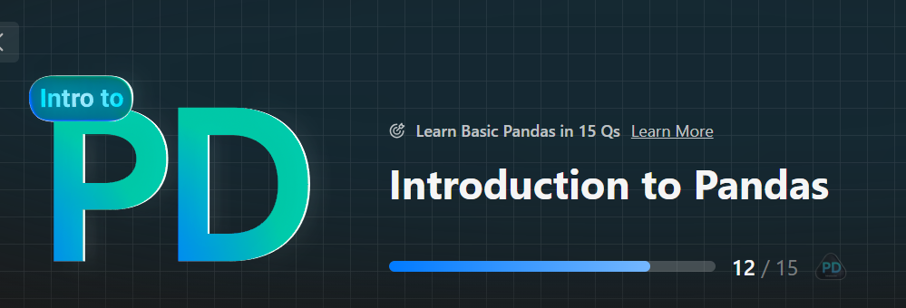

# Introduction-to-Pandas-Leetcode
This repository provides an introductory guide to using Pandas for data manipulation, alongside solving 15 LeetCode problems. The goal is to help you get comfortable with data analysis techniques using Pandas while simultaneously practicing coding problems that are commonly asked in technical interviews.

# What you'll find in this repo:
- **LeetCode 15 Problems:** A collection of 15 LeetCode problems, including the problem description, solution, and detailed explanations. 
- **Pandas DataFrame Operations:**  Step-by-step solutions using Pandas for various data manipulation tasks, including sorting, grouping, merging, filtering, and more.
- **Hands-on Pandas Practice:** Code examples and explanations that demonstrate how to efficiently use Pandas for solving data-related problems and preparing for coding interviews.

# Topics Covered:
- **Introduction to Pandas DataFrames**
- **Data cleaning, manipulation, and aggregation**
- **Merging, joining, and reshaping data**
- **Practical usage of common Pandas functions**
- **Solving algorithmic problems using Pandas**
  
Whether you're a beginner to data analysis or preparing for technical interviews, this repository will provide a solid foundation in Pandas with hands-on problem-solving experience!

Follow on Socials: [YouTube](https://www.youtube.com/@DataGenious/) [LinkedIn](https://www.linkedin.com/in/iamamitdev/)

Want to Contribute? Yeah, Contributions are alwyas welcome !! If you would like to contribute to the project, please fork the repository and make a pull request. Do ⭐ the repository,if it helped you in any way !!

Cheers 🍻  
Data Genious
